<div align="center">

# Дрейф · Drift

**A procedural space game in a single HTML file.**
No build step, no dependencies, no frameworks, not one asset file — every pixel and every sound
is generated at runtime from seeds.

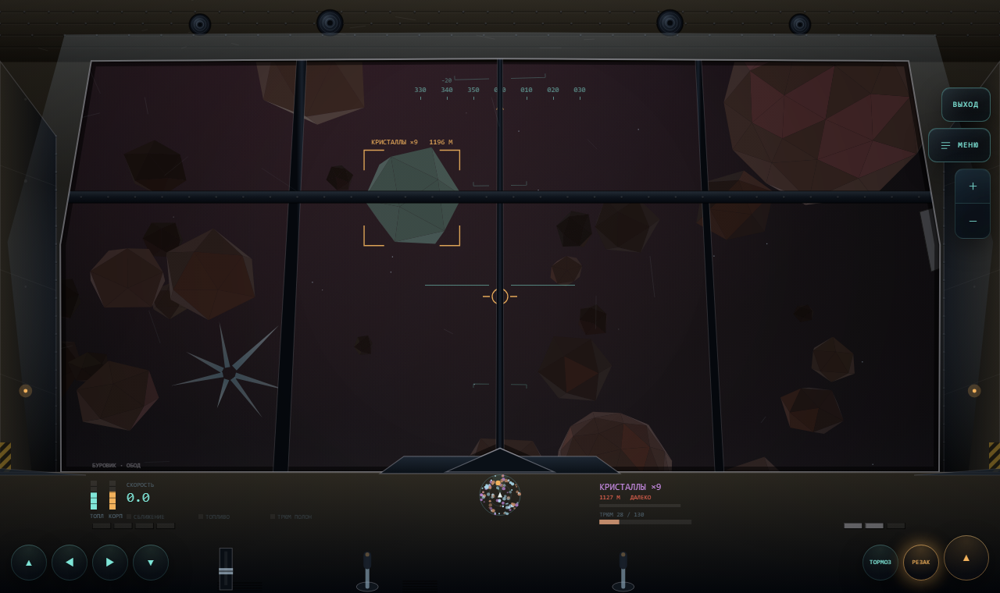

</div>

Pilot a lone survey probe through an endless generated galaxy: prospect planets, tunnel into their
crust, strip asteroid belts, skim gas giants, run trade routes across a living market, found bases,
hire a crew that works while you are away, board pirate stations on foot — and come back to a home
that grew out of what you earned.

> **Play it now:** download [`drift.html`](drift.html) and double-click it. That's the whole game —
> one file, offline, no server.

---

## What it looks like

Nothing below is hand-drawn. Hulls, cockpits, terrain, cloud bands, star fields and interiors are
all built from the same seed that names the system you are in.

<table>
<tr>
<td width="50%" valign="top">

<b>The galaxy map is drawn as a night sky.</b> Stars emit light instead of sitting on the
background — halo, colour and diffraction spikes come from the spectral class. Depth is darkness:
distant sectors dim, unreachable ones halve. The jump radius is a lit area instead of a hairline
circle, and lanes are drawn only where they mean something.
</td>
<td width="50%" valign="top">

<b>Flight leaves a wake.</b> The exhaust ribbon lives in system coordinates, so a turn draws the
trajectory you actually flew. Its colour comes from the hull and its length from engine thrust and
the fitted engine module — an upgrade shows in flight.
</td>
</tr>
<tr>
<td width="50%" valign="top">
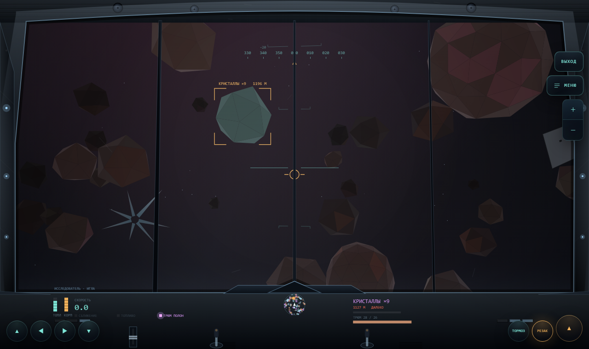
<b>The cockpit tells you what you fly.</b> A survey ship gets a thin frame, clean plastics and a
hologram over the dash; the miner at the top of this page gets heavy pillars, a cross beam, rivets,
grime and hazard stripes. The canopy opening has real thickness — an outer and an inner contour with
a lit bevel between them.
</td>
<td width="50%" valign="top">

<b>Gas giants are flown through.</b> Latitude bands are never drawn as shapes — they are
stripes warped sideways by two scales of noise, with storms bending the same field, so festoons and
vortices appear on their own. Two parallax echelons give the speed; the collection corridor is a
glowing layer of denser gas you fly inside.
</td>
</tr>
<tr>
<td width="50%" valign="top">

<b>A base is a shelter cut into a hill.</b> The ground above rises into a hill with the works buried
in it, and a gate in the slope explains how anyone gets in. Inside, rooms glow against near-black
rock: partitions between compartments, a floor slab per level, a lit lift shaft binding the levels
into one building, and doors with light under them. Nobody stands there unless you actually posted
crew — the shift you see is the shift you hired.
</td>
<td width="50%" valign="top">

<b>Pirate stations are boarded on foot.</b> The same projection and painter sort the asteroid belt
uses, with walls shaded top-to-bottom, distance haze, ceiling lamps and dust hanging in the beam of
your helmet lamp. The gun you fitted to your ship is the gun you carry.
</td>
</tr>
<tr>
<td width="50%" valign="top">
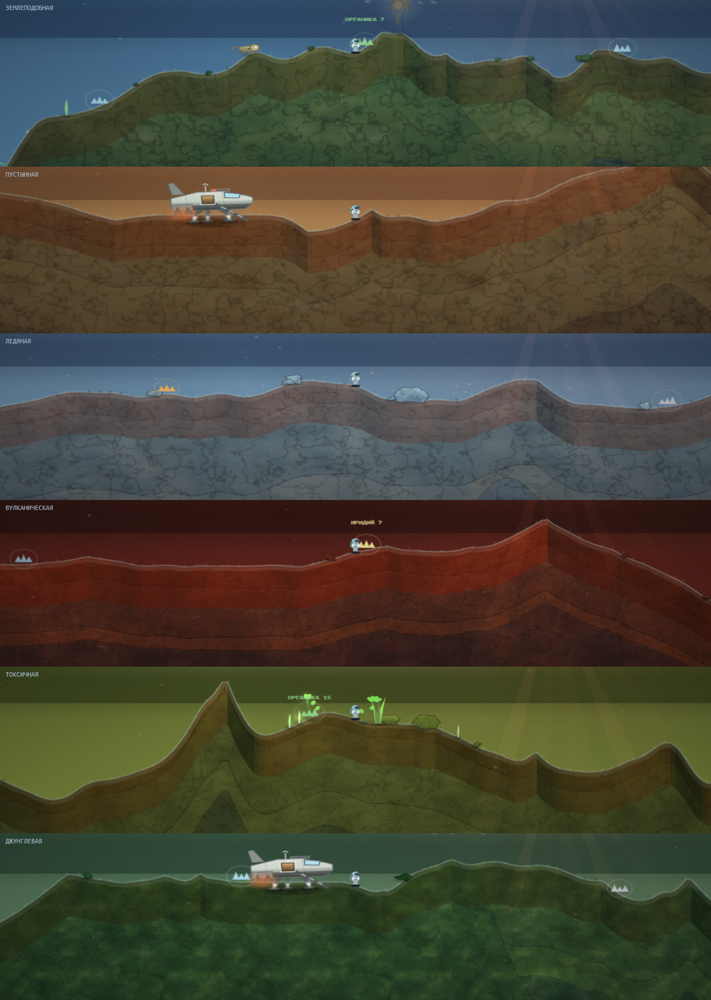
<b>Where you land is what you saw from orbit.</b> The globe and the ground used to be two different
noises sharing a name. Now the longitude you approach from — minus the planet's own slow rotation —
picks the spot, and the terrain takes its low frequency from the same field that prints the texture:
a bright patch is high ground, a dark one a basin. A second field is moisture, so the green blotch
you aimed at really is a thicket when you get out, and the dry belt of the same planet is bare.
</td>
<td width="50%" valign="top">

<b>The cantina is a room with people in it.</b> Candidates sit at the counter, drawn with the same
procedural faces as the manager list, in front of a window that matches the station type. You pick a
you hire by clicking the person.
</td>
</tr>
<tr>
<td width="50%" valign="top">
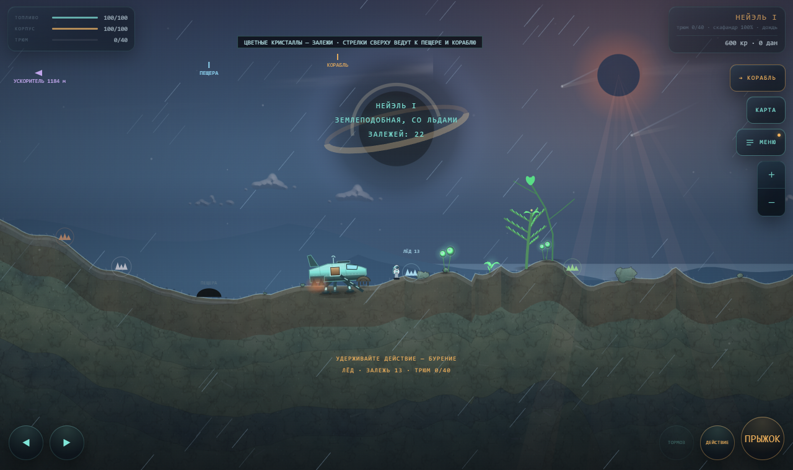
<b>The lander is a working machine.</b> The flight view is top-down and the landing view
is side-on, so the lander has a silhouette of its own: three and a half to five human heights long,
three-point gear with shock struts whose pads each settle on their own patch of ground, an open hatch
with a lit interior and a ramp whose 10 px steps give you the scale at a glance. Touchdown is a
movement — legs deploy on approach, struts compress under the impact and spring back, the nose dips.
</td>
<td width="50%" valign="top">
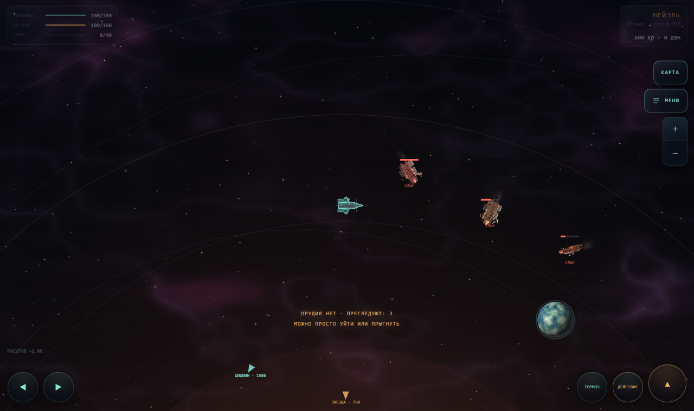
<b>Pirates weld their ships out of three other people's.</b> Sixty to a hundred and twenty polygons
instead of a dozen, asymmetry as a rule — a pylon on one side, a tank on the other,
a whole foreign section welded to one flank. Damage accumulates with the hull: scorches, then a
breach with a flame, then a smoke trail. Below half, the ship is baked a second time with its hung
gear torn off and bites taken out of the plating, so a wreck reads by shape.
</td>
</tr>
<tr>
<td width="50%" valign="top">
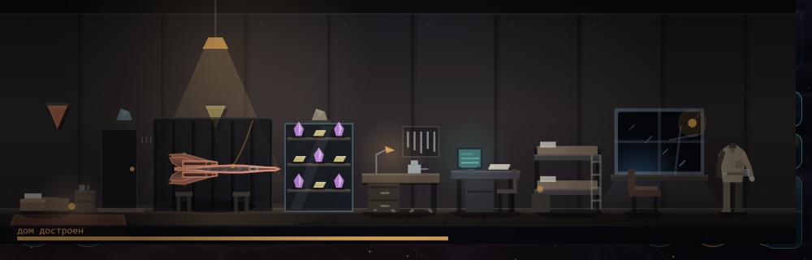
<b>Your home is a room you walk into.</b> It grows on its own out of accumulated
turnover — one lamp, a warm wall, and everything you have earned standing on the floor: the mattress
of the rented corner, the garage with your ship on props, the showcase, the workbench. Each tier adds
its own stretch left to right, and the picture is exactly as wide as the house is. There is not one
price on the screen.
</td>
<td width="50%" valign="top">
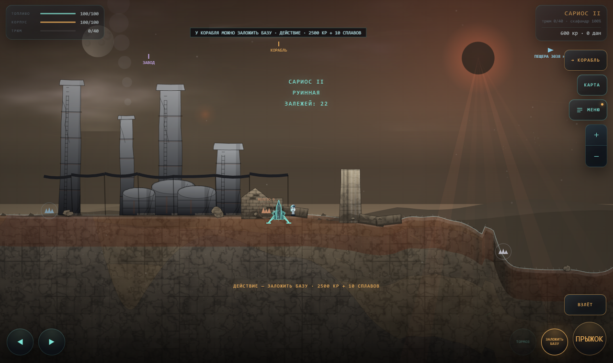
<b>A ruined world is masonry under dust.</b> The ground itself follows a rubble law — rectangular
blocks along the axes, in patches, because continuous brickwork reads as graph
paper. Standing on it are wall fragments with courses, a doorway and fallen column drums.
</td>
</tr>
<tr>
<td width="50%" valign="top">
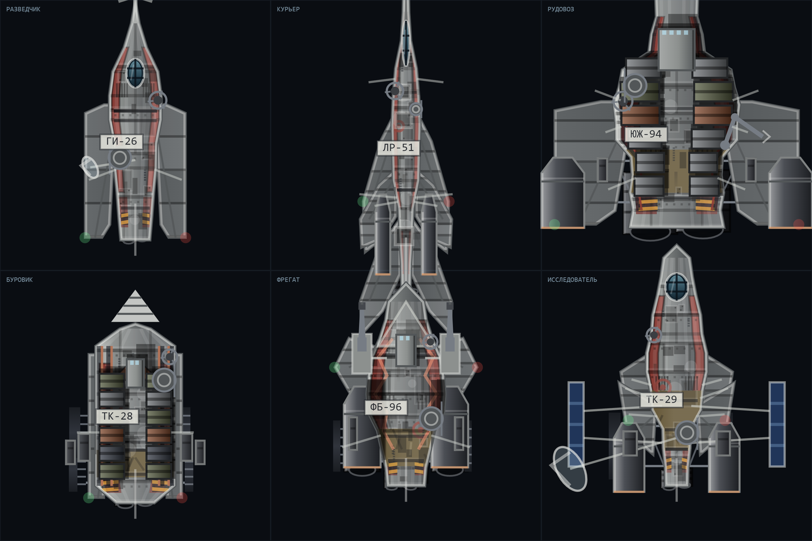
<b>The fleet is painted like industrial hardware.</b> Bone primer instead of the owner's colour —
that colour survives as one painted panel along the flank. Plating is assembled from sheets with
seams, tone variation and rivets; engines are graphite barrels that stick out past the outline;
stencils, hatch numbers on plates, grilles, hazard stripes and a roundel do the rest. A planform is
chosen per hull — delta, cross, catamaran, slab, disc, trident, swept — so about fifty silhouettes
share one language. Pirates fly the same hulls with the number painted over.
</td>
<td width="50%" valign="top">
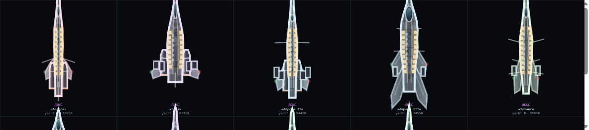
<b>A luxe yacht is the one hull bought for its looks.</b> Long thin body, a manta wing grown out of
the hull by a strake, spindle nacelles standing on the plate with needles forward. Four surfaces no
other ship has: lacquer with metallic grain, teak laid only where a person walks, brass edging, a
pearl superstructure under a glass dome. Three engine schools, three finishes, a name in brass
instead of an inventory number — and thrust that runs cool and quiet.
</td>
</tr>
<tr>
<td width="50%" valign="top">
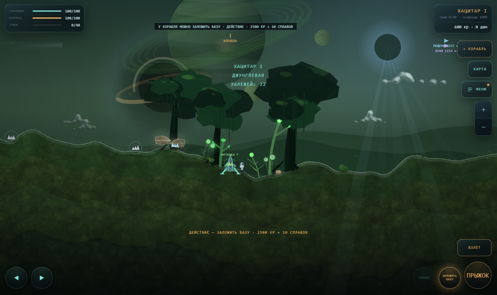
<b>Under a canopy it is dark.</b> The moss law is the inverse of the obvious one: mostly deep shade
with light punching through in patches, ground litter and dark roots. Canopy trees are tiered dark
masses with branches to the trunk and hanging vines that sway on the world's own wind.
</td>
<td width="50%" valign="top">
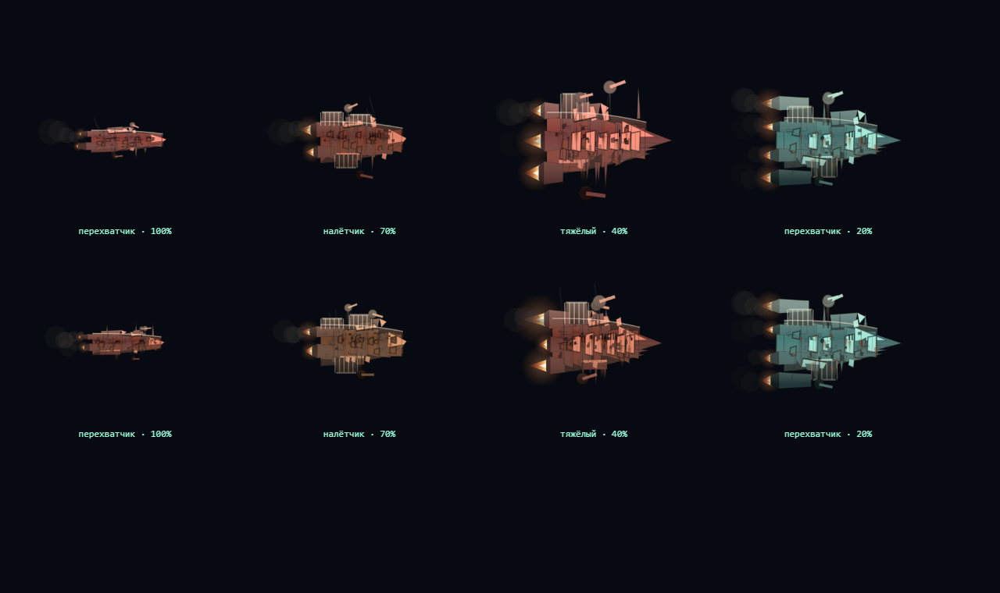
<b>Four pirate classes read at a glance.</b> The interceptor is small and narrow, the raider carries
cargo cages with pale bars, the heavy leads with a ram and armour plates, and the renegade's flagship
is <i>your</i> real hull with other people's scrap welded over it. Each is baked once into an
offscreen canvas from its seed, so a hundred polygons never reach the frame.
</td>
</tr>
<tr>
<td colspan="2" valign="top">
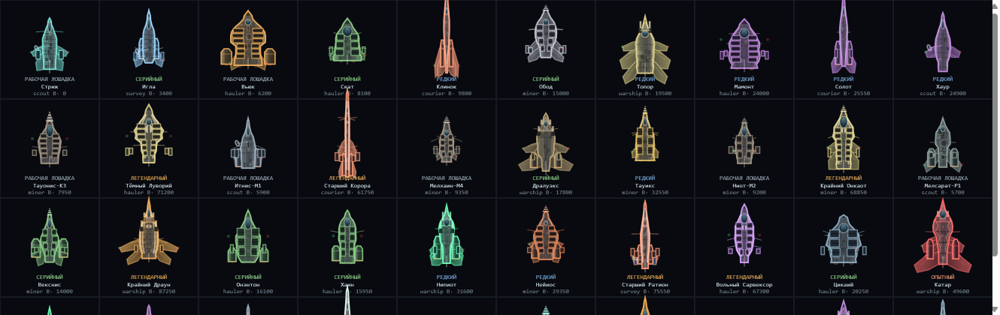
<b>A hundred hulls, and the tier is in the hull itself.</b> Class comes from proportion — the
courier is a needle, the freighter a crate with containers strapped to its flanks, the yacht a
spindle. Tier comes from finish: a workhorse wears patches and streaks, a rare hull an accent line,
a legend double piping and a crest emblem, a prototype its guts on the outside. Colour is per-ship,
because painting a hundred hulls by tier produced a fleet in four colours.
</td>
</tr>
<tr>
<td width="50%" valign="top">

<b>Luxury yachts never pay for themselves, and that is the point.</b> A hold of two crates, a strip
of lit windows down the flank, a gloss highlight along the spine, and a price the size of a house.
The only thing a yacht does is let the crew rest on it between runs — morale, not credits.
</td>
<td width="50%" valign="top">

<b>The HQ screen is a room.</b> Four domain consoles, and at each stands whoever holds
that domain — pose per role, portrait per person. The screens show real state: crew on assignment,
drones and bases, the route polyline with a ship crawling along it. An empty domain is a dead
console under a dust sheet. On the holo table is <i>your</i> system: your star, your planets.
</td>
</tr>
<tr>
<td width="50%" valign="top">
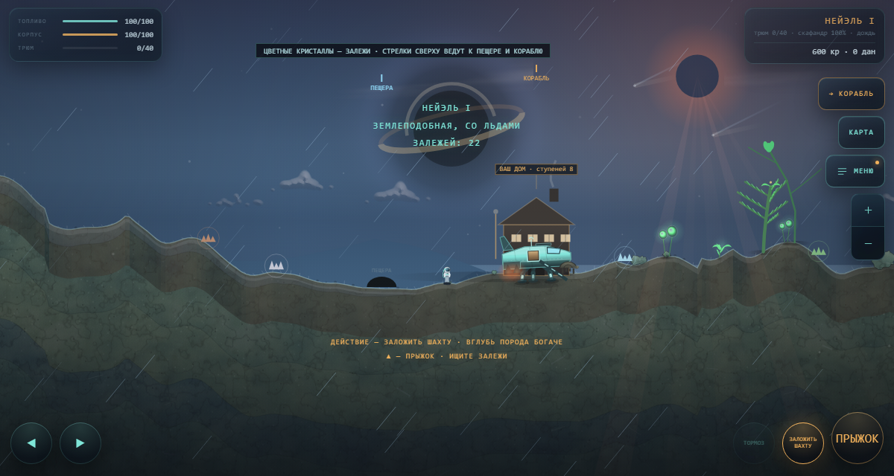
<b>What you own stands on the ground.</b> Land on the planet where your base or your home is and you
see it on the horizon — no menu needed to learn it exists. The spot is found by searching for level
ground, because the first version put the house on a slope and buried half the door. Windows count
your home's completed tiers; the eighth lights the mooring beacon.
</td>
<td width="50%" valign="top">
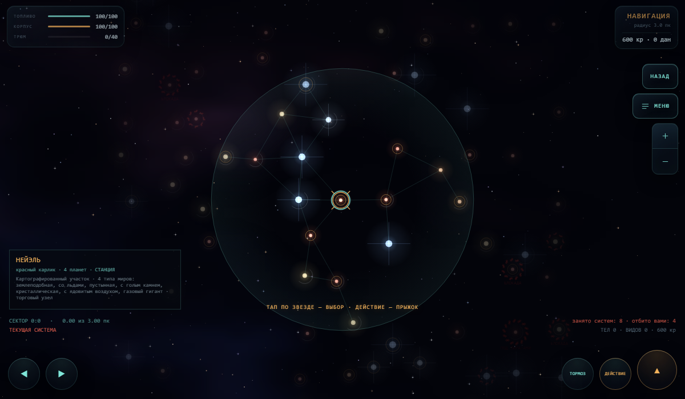
<b>Pirates take systems, and the front is visible.</b> Occupied systems wear a toothed cordon that
does <i>not</i> dim with distance — depth belongs to the stars, not to the thing you are looking
for. A blockade closes the dock and stops drones selling; full occupation leaves only refuelling.
You take a system back by fighting in it.
</td>
</tr>
<tr>
<td width="50%" valign="top">
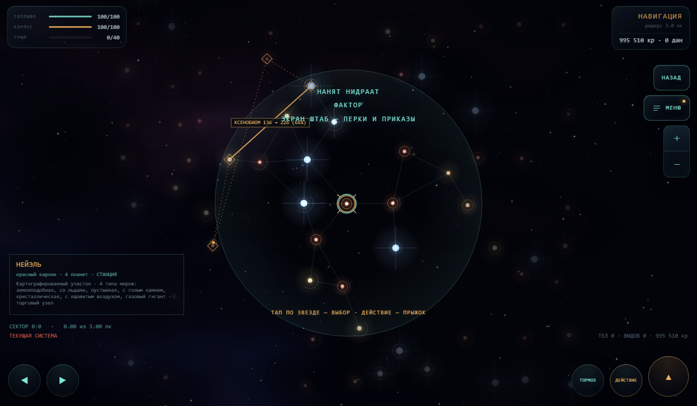
<b>Your factor's trade route lies on the map.</b> Dashes between the legs, diamonds on each station,
a ship crawling along the line, and on the best leg the deal itself: goods, buy price, sell price,
margin. The domain earns from the real market — and once it is drawn, you can fly that spread
yourself.
</td>
<td width="50%" valign="top">
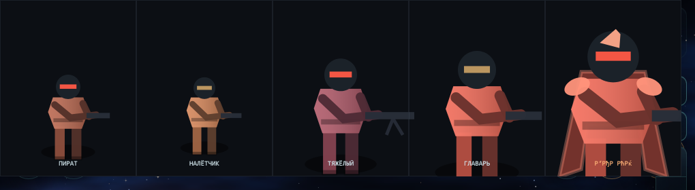
<b>Boarders have bodies.</b> Shoulders wider than hips, legs apart in two tones, both hands on the
weapon, a visor band instead of an eye dot. The heavy braces a bipod; the baron wears a split cloak,
pauldrons and a crest — rank reads from the shoulders.
</td>
</tr>
<tr>
<td width="50%" valign="top">

<b>The repeater sits on a perch you can open at any time.</b> It came out of a dead scout's effects
and it repeats what it overheard — prices from a station you have already left, a bearing, a phrase
in the expedition's pidgin you cannot read yet. Poke it and it answers from memory: five zones, five
reactions, and never a line it did not hear. Everything on it is drawn and animated at runtime —
breathing, blinking, a wing beat that lifts the whole body, and the beads on the crest lagging half
a beat behind the head.
</td>
<td width="50%" valign="top">
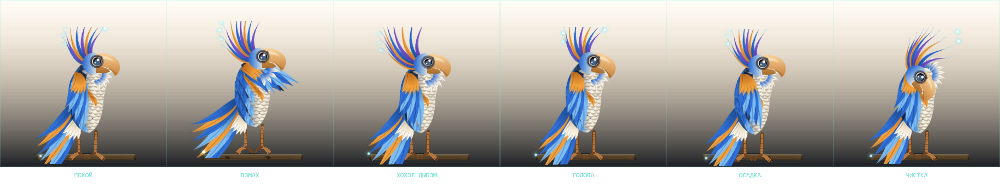
<b>Poses come from springs, not frames.</b> Rest, wing beat, crest up, head turn, settling, preening
— every one of them is the same body under different forces, so a poke resolves back to calm on its
own. The sheet is the tool: each fault in the drawing was found by looking at six poses side by
side, never at one.
</td>
</tr>
</table>

---


## Gameplay

### Worlds

Twelve true world types — terran, ocean, desert, rocky, ice, volcanic, toxic, crystal, jungle, metal,
ruin and gas giant — and **most planets are a blend of two of them**. A blend goes deeper than colour: the
palette, roughness, gravity, sky, relief weights, strata, weather pool, clouds, musical mode and ore
profile all mix by the same share, and the name comes out as "icy, with volcanoes". Air never mixes:
you either breathe it or you don't. Kinship is deliberately asymmetric — a volcanic ocean exists, an
oceanic desert does not.

- **The ground is a material.** Every planet bakes one seamless tile holding three scales
  at once (geological patches, sedimentary runs and veins, grain and crystal specks), laid twice at
  different zooms so the repeat never reads.
- **Late worlds have their own law of form** on top of that noise, because colour alone was not
  enough: faceted cells with one lit edge for crystal, big plates with a dark seam and rust runs for
  metal, a dappled dark canopy for jungle, axis-aligned rubble for ruin.
- **Weather can't overrule the world.** Each type caps how strong its weather gets, so a crystal
  planet is never painted flat white by fog — the reason you flew there stays visible.
- **Three scales of object.** Boulders underfoot, a middle scale that belongs to the type (druses,
  torn hull plates, broken trusses, walls, columns, canopy trees), and two to four landmarks per nine
  thousand units of terrain — a wreck, a temple, a space elevator, an accelerator ring, an anomaly.
  The emptiness between them is deliberate: without it a find stops being a find.

### Flying

- **Autopilot** — tap any object to approach, close in, and dock automatically. It aims at an intercept point, so it converges instead of chasing a moving body around its orbit. Near a planet or moon it captures a stable co-rotating circular orbit and holds it until you throttle, brake or turn.
- **Manual control** — thrust, a brake that kills velocity outright, and turning with real angular inertia: the ship carves an arc and banks into it instead of pivoting on the spot. Every key is rebindable (separate layouts for flight and for the belt), and on-screen buttons auto-hide when you are driving from a keyboard.
- **Branching star map** — systems laid out organically with connecting lanes, each with generated flavour text describing its worlds, belt and station. Planets follow elliptical Keplerian orbits; orbital speeds are capped by *tangential* velocity so every body stays catchable even in the starter ship, while distant worlds still move more slowly than close ones.
- **Gravitic anchor** — drift too far from the star and a gentle pull, plus an on-screen compass to the star, station and current target, brings you back. A one-tap "TO STAR" autopilot works from anywhere.
- **Stranded restart** — out of fuel with no way to refuel, you can pay for emergency evacuation. Without the credits you wake up at home, take a ship out of the garage and lose the cargo and half your credits; before there is a home to go back to, you get a fresh starter ship at the origin system, never a dead save.

### Getting materials

- **Surface prospecting** — land on generated terrain (ridges, mesas, dunes, cratered plains, canyons, mixed to suit the world type), mine visible deposits, and scan alien flora and fauna for research data. Click-to-walk works alongside the keyboard; launch lives on its own hold-to-confirm button.
- **Wildlife** — every planet has a genome biasing its plant and animal forms, sizes and hues, so worlds look distinct — ankle-high moss and crystal druses on one, giant trees and oversized fauna on another. Underground the same stock bites through your suit; an EMP pulse stuns them, and a stunned one can be sampled for carbon and rare xenobiome that no rock will ever yield.
- **Deep shafts** — sink a mine on bare ground and tunnel through three depth tiers. Ore lives in scattered veins, highlighted through rock when close or from range with the geo-scanner. Deeper rock is roughly 2× and 4× richer, gated behind drilling tech and pressured by suit wear and cave-ins. Damage underground costs your suit, never your ship.
- **A shaft stays dug.** Come back to a mine you started and you drop into your own tunnel: only the excavated cells are saved, everything else (ore, hardness, veins) is still derived from the seed.
- **What you built stands on the ground.** Land where your base or your home is and you see it from the surface — no menu required to learn it exists.
- **Cave systems** — some planets hide a walkable cave mouth: a winding natural passage lit only by your suit lamp and glowing flora, with hostile fauna and a one-off data find at the far end.
- **Asteroid belts** — a full 3D flight mode flown from a generated cockpit. Pitch, yaw and roll with inertia, the horizon banking into your turns. Rocks break into drifting debris as you mine or shoot them apart.
- **Gas skimming** — gas giants can't be landed on, but you can enter their upper atmosphere and collect volatiles. The scene is a narrow altitude corridor: above it the scoop takes nothing, below it hull heat climbs until the ship burns, and turbulence keeps pushing you out of the band. Flying it is the mechanic.

### Rare materials

Ordinary ore is cargo looking for a buyer. Four rare materials are the opposite — **the market refuses them entirely**, so they stay goals instead of expensive cargo, and cannot inflate prices. Each has its own verb:

| Material | Source |
|---|---|
| Volatiles | atmospheric skimming on gas giants |
| Ice crystals | belts on distant, cold orbits only |
| Alloys | never mined — smelted from ore at industrial stations or a base refinery |
| Tech components | boarding a pirate base, and nowhere else |

They are spent on the laboratory, base construction and hull fusion. Drones only work materials they can sell, and pirate wrecks never drop rare stock.

### Stations

Six station types, chosen by system seed and how dangerous the sector is. **The type decides which tabs exist at all**, as well as how the place looks:

| Type | What it is for |
|---|---|
| Trade hub | best prices, broad market, weak yard — thins out toward the frontier |
| Industrial | smelts ore into alloys, repairs at half price |
| Shipyard | the only place that builds a one-off unique hull |
| Science | tech tree and the fusion laboratory |
| Frontier outpost | combat crews, weapons, poor prices — common in dangerous space |
| Fuel depot | no tabs whatsoever: fuel and repair only, but found far out |

Each type draws itself procedurally the way hulls do — a shared skeleton of core, dock and lights with the silhouette from the type and the details from the system seed: warehouse pods and cargo booms, blast furnaces with a flare stack, an open slipway with a crane crawling along it, dish antennas and radiator grids, gun turrets, or a bare tank.

### Crew and fleet

Old hulls sitting in your hangar stop being dead weight: **a hire needs one of your ships**, which is the decision the whole system turns on.

- **Mercenaries are generated people** — name, specialty (combat, mining, hauling), two or three traits that are pure multipliers and thresholds. A veteran costs more and comes back. The careful one breaks off early and brings less. The greedy one skims the hold. The stubborn one ignores your first order.
- **Orders** — hunt pirates, mine, run a route, work a base, or sit idle. Each carries a sector and resolves the way drones do: from elapsed time, capped at eight hours offline. No NPCs fly around in the background.
- **Wages and consequences** — pay is drawn on the same lazy clock that pays out. Run dry and debt accrues, morale slips, the log warns you, they work at half strength, then abandon the order, then leave and take the ship against what they are owed. Every step is visible before the last one lands.
- **Damage and repair** — dangerous orders cost hull. Repair is free and slow while idle, instant for credits. A hull reaching zero loses the ship and only sometimes returns the person.
- **Experience** raises both what they produce and what they demand, so a cheap hire becomes an expensive veteran you would rather not lose. Fleet size is a researched licence.
- **Meeting them in space** — fly into a sector where your crew is working and they spawn as a real ship alongside you, built on the pirate NPC frame, shooting at pirates.
- Everything they do lands in the ship's log: deliveries, bounties, damage, warnings.

### Managers and domains

Mercenaries fly your ships; **managers take a whole domain off your hands** — the crew wing, drones
and bases, a trade route, or the laboratory. There are exactly four seats, one per domain, and the AI
core takes one of those four instead of adding a fifth: the system is about which chore you hand over, not
about growing a headcount.

- **A cut of the domain.** Each manager draws a salary *and* a percentage of their own domain, taken
  before the money reaches you and always shown as a line — hidden, it reads as theft. Audit tech and
  one artifact are the only things that shave the cut for everyone.
- **Loyalty is the whole tension.** Miss payroll and it slides; below fifty a manager quietly starts
  "losing" a slice of the domain in their own favour, and the only trace is a discrepancy line in the
  domain summary. At twenty-five they issue an ultimatum you can pay or refuse.
- **A manager who leaves flies against you.** At zero loyalty a manager defects and becomes a renegade in their own
  sector, flying your flagship with your perks. Beating them does not kill them: they turn up in a
  cantina as an exile, cheaper to re-hire and remembering everything.
- **Every perk is wired to something.** The whole tree is visible from the start, including what you have
  not bought, and a test refuses to pass if any perk id in the tree is not read by the game.
- **Procedural portraits** that gain detail with level and darken as loyalty drops — a sour face is
  visible before any bar is.
- **Artifacts** — seven of them from the laboratory, one worn per manager, each with a second line of
  effect that unlocks deeper in.

### Home

There is exactly one home in the universe and **it is not for sale**. Rooms bought with credits would
turn it into another shop; instead the home grows out of *accumulated turnover* — everything the
universe has paid you, from sales and drones to domain income, mercenary runs, bounties and base
takings. Nothing is ever deducted: you do not buy the place, you earn it, and money already spent
still counts toward something you own.

- **It appears on its own** after your first honest sale, in whatever sector you happened to be in,
  and never moves. Eight tiers follow: a rented corner, a hall, a garage, a showcase, a workshop, a
  study, living quarters, and a berth with a beacon.
- **Death stops being a wipe.** Losing your ship with no money for evacuation used to hand you a bare
  starter hull back at the origin system, erasing the whole run. Now you wake up at home, take a ship
  out of the garage, and lose the cargo and half your credits instead of your history.
- **The tiers do things.** The study gives every manager one more standing-order slot; the living
  quarters double morale recovery; the showcase turns displayed rare material into reputation worth
  up to a tenth extra from your domains; the workshop rerolls a part's affixes one tier down — not an
  upgrade but a second throw, so junk becomes usable and good parts are not worth touching.
- **It cannot be farmed.** No free fuel, repairs or weapons; the beacon home is paid for and gets
  dearer the further out you are, you fly away under your own power, and anything on the showcase can
  never be sold.

### Bases

The planet stays flat 2D; the volume comes from **a cut through the ground** — sky and surface on top, buried compartments below, a lift shaft down the middle.

- **The grid is the game.** An empty cell is rock you dig out to place one module: reactor, solar array, drill, storage, habitat, refinery, landing pad.
- **Power is the whole problem.** Run short and you see it at once: the lights dim across the entire cut and the drill stops turning.
- **Adjacency matters.** A drill wired to a neighbouring reactor loses less; a habitat pressed against one is a worse place to live.
- **Staff** — crew can be posted to a base instead of a ship, in four roles: driller, engineer, guard, logist. Any role is open to anyone, but working outside your speciality halves your contribution.
- **Raids** — pirates come for what is stored there, more often the deeper into dangerous space the base sits. An unguarded raid carries off part of the store and sometimes wrecks a compartment, which sits dark and crossed out until an engineer rebuilds it.
- **The network** — a station panel shows every base, what it digs, how full it is and what is wrong with it. Build a landing pad and you can jump straight there for fuel and credits; station a logist and you can collect the store without flying out.

### Boarding pirate bases

Dangerous sectors hold pirate stations you can board on foot. The map is a 2D grid — rooms carved out, corridors drawn between them so connectivity holds by construction — but it **draws as polygons** through the same projection and painter sort the asteroid belt uses, so this is reuse, not a second renderer.

- **The gun you fitted to your ship is the gun you carry**, so the build you fly decides how the boarding goes. The suit is your health, the same one the mine models.
- **Four enemy types** share one AI and differ only in numbers: rushers close to arm's length, heavies hold back and hit hard, and the bridge keeps a boss. Which compartment you are in decides who is waiting.
- **Supplies are finite** — ammunition runs out, so the store room matters; medkits and armour plating lie where they make sense and are picked up by walking through them.
- **Rooms have mezzanines** with ramps up, which is what the polygonal renderer was chosen for: floors at two heights, real edges on the drop, camera following you up. Corridors get door jambs, reactor bays pulse with emergency lighting, and a helmet lamp lights whatever you face.
- **Loot is the stake** — reach the hangar to leave with it, or get your suit punctured and lose half on the way out. Progress itself is never rolled back.

### Getting stronger

- **A hundred hulls in six tiers** — eight hand-built ships plus a deterministic catalogue of ninety-two, from workhorses that stand in every dock to legends counted in single units and luxury yachts that never pay for themselves. What a dock actually stocks is a *slice*, keyed to that station's seed and a time bucket: a hundred-line list would be a warehouse. Rarity shows in the finish of the hull itself, and a cheap hull is always available so you can never be stranded.
- **A thousand nodes and ten crowns** — named artifact nodes in ten families of a hundred, five grades of rarity. A node does nothing on its own; it is a letter. Complete a family and it forges a **crown** — an effect you cannot obtain any other way, read by `stat()` alongside modules and parts. Nodes are never sold or crafted: they only drop, and rarely, from pirates, deep shafts and boarding actions.
- **Ships** — one-off generated hulls still turn up at shipyards and rotate over time.
- **Modules** — seven upgrade tracks (engine, tanks, hold, armour, drill, hyperdrive, gun), four levels each. Buying a level is permanent; fitting it is not.
- **Parts and rigging capacity** — every hull has a rigging budget that modules *and* parts draw from, so you cannot run everything at once. Parts are generated across six categories with one to three affixes, and the strong ones carry a real drawback — a drill that outpaces your turn rate, a shield that costs you thrust. They drop from pirates as containers you fly through, and stations sell a rotating handful.
- **Ship screen** — slots are drawn on the hull itself: a gun point on the wingtip, an engine block at the nacelle, a reactor in the belly. Every candidate part states exactly what it would do to your numbers before you commit.
- **Laboratory** — at science stations, two ships from your hangar plus rare material fuse into a third. Stats blend weighted toward the stronger parent instead of summing, surplus rare stock adds a percentage, and both originals are consumed. Each generation costs 1.8× more and adds a fraction as much, so it is a ladder with a top. The same bench crafts parts from rare material at three tiers.
- **Tech tree** — research paid for with survey data, including repeatable tracks that keep scaling.
- **Return beacon** — researched tech that teleports you back to your lander from anywhere on the planet, on a cooldown.

### Economy and logistics

- **Living market** — every station's prices sag when you dump cargo there and recover over time, so where you sell matters and routes are worth planning. Station type shifts prices on top of that.
- **Mining drones** — buy one, drop it on a deposit or asteroid, fly away. It works in real time, hauls to the nearest station and sells at live prices.
- **Barter shop** — a tab where unique gear costs specific raw resources instead of credits.
- **Ship's log** — a collapsible panel recording what actually happened: kills, drone deliveries, sales, research, discoveries, crew reports, base raids, wrecks. It persists with your save.

### Landing

Setting down is its own short flight. You fly the lander against real gravity for the
world, and touching down too fast, too sideways, tilted, or on a slope costs hull.

- **The lander has its own side-on silhouette** — 90 to 130 px against a 24 px astronaut, because the
  flight view is top-down and rotating one into the other does not work. Its hull colour,
  livery and class markings still come from the ship you actually fly.
- **Landing gear behaves.** Legs unfold on approach, each pad settles onto its own patch of terrain,
  shock struts compress under the impact and spring back, and the nose dips with them.
- **Thrust is vertical**, so three retro nozzles fire from the belly, never the main engines, and
  the jet raises a low cloud of ground-coloured dust that lingers after touchdown. On an airless world
  the dust is lower and sharper — there is nothing for it to billow in.

### The front: pirates take systems

Pirates used to be weather — a few of them in dangerous sectors, and nothing you did changed that.
Now they hold ground.

- **Occupation spreads from somewhere.** A nest, then its neighbours; never a random flare on the far
  side of the galaxy, so what you see on the map is a front, not a rash.
- **Occupation takes services away.** Level one puts patrols out and lets the single buyer
  underpay you. A blockade shuts the dock and the laboratory and stops drones from selling. Under
  full occupation only refuelling is left.
- **Ranks.** Jackal, veteran, captain, and — only under full occupation — a **baron**, three times
  the toughness of a mini-boss, sitting on the bridge of what the game now calls the baron's lair:
  the same boarding action, harder, and named accordingly.
- **You take a system back by playing the game in it.** Kills count per system; hit the quota and the
  level drops. Clearing it pays a prize and turns the station back on. Breaking the pirate base itself
  *suppresses the nest*: the advance around it stalls for a day.
- **Three goals are stated out loud** on the holdings screen — the home that grows from turnover, a
  yacht of your own, and a galaxy without occupied systems. All three are counted from real state,
  with no quest flags anywhere.

### Work that pays

The cantina seats people with their own business, and none of it is "bring me ten ore". You only ever
**answer**: buy a captain's debt at a third of face value, vouch for a pilot nobody will hire, take a
crate with no explanation, back a bet on someone else's race, buy a survey map off a geologist who
was thrown out of his expedition, carry a passenger with no return ticket. Every answer costs
something — there is no free option on any of them — and answers with a tail become entries in the
journal with an address and a deadline. The outcome roll is made in advance from the deal's key, so
the same deal cannot end differently depending on when you open the journal.

The **journal** is where accepted business lives: what you took, from whom, how long is left and what
was promised. Every line with an address is clickable, and clicking lays the course on the map.

### Pirates

The main antagonist used to be drawn with the player's own hull generator in a different palette — a
dozen polygons, clean symmetry, tidy panels. Now a pirate **welds his ship out of three other
people's**, and that is his language of form.

- Sixty to a hundred and twenty polygons: a dark body mass, a spine of overlapping plates, a nose or
  a ram, side modules, cargo cages, engines. **Asymmetry is a rule** — a pylon on one
  flank, a fuel tank on the other, a whole foreign section welded on, and the scrap collects on the
  "busy" side.
- Hung over that: patches lapped over the seams, spikes, tow hooks, turrets on guy wires, whip
  antennas, rust running from every weld, kill marks by seed.
- **Damage is visible and cumulative** — scorches, then a breach with a flame, then a smoke trail.
  Below half hull the ship is baked a second time with its hung gear torn off and bites taken out of
  the plating: a wreck reads by silhouette instead of a health bar.
- Exhaust is dirty and out of sync, and one engine on every pirate always smokes harder than the rest.

### Danger is optional

Pirates are absent near home and increasingly common the further out you push. Fighting has its own gun module and bounty tech, but outrunning or jumping away is always cheap and always valid. Bases, boarding and mercenary hunts are opt-in layers on top.

## How it looks and sounds

- Every hull is generated from its seed: multi-station fuselage profile, swept wings, engine nacelles, canopy, panel lines, greebles, livery, blinking navigation lights. Banking is a real roll — the silhouette squashes and a shaded belly peeks out. Pirates get their hulls the same way.
- The belt cockpit is generated per hull class: canopy shape, frame weight, metal, wear, hazard striping, holography and indicator colour all follow what you fly, and a laboratory-fused hull gets an asymmetric organic frame nothing else has. The opening has thickness, the glass carries tint, glare, a reflection of the dash and scratches, and the yoke and throttle move with your inputs. What it never does is cover the view: everything laid on the glass is transparent, and the six instruments left on the dash are the ones nothing else already tells you. The ship that sets down on a planet is the ship you fly, on deployed legs.
- Plants, creatures and boulders are generated per world: branching stems with ferns, pods or crowns; critters with their own colours, crests, tails and leg counts; layered strata showing through rock.
- Layered engine flames and an exhaust ribbon that hangs in space where you burned, tinted by the hull and stretched by the engine module. Attitude jets fire against the turn, the way a real pair does — bow thruster one way, stern thruster the other — and braking uses the bow jets instead of spinning the ship around. Faceted rotating asteroids lit by the system's own star, ringed gas giants, a generated nebula and coloured twinkling starfields.
- A graphics page dials draw distance, model detail, particle density and surface life density up or down, with presets, to trade looks for performance.
- **Every sound is synthesised at runtime** — there is not one audio file in the project. Oscillators, filtered noise and envelopes make the engine hum that rises with throttle, weapon fire, hull hits, the drill, footsteps that follow your actual walk cycle, low-fuel warnings. Guns take their timbre from the fitted part's seed, and each creature's call comes from its own seed. Music, effects and engine get separate volume sliders.
- **Generative music** — no tracks, just six layers (drone, bass, motif, beacons, percussion, atmosphere) drifting in and out, so there is no loop to notice. Notes swell over a second or more and trail into synthesised reverb and feedback delay. The beacon voice is brown noise squeezed through a very narrow band-pass filter, which turns noise into a pitch that breathes. The melody is a real phrase that walks the scale, sometimes answered a beat later by a third or a fifth. Sixteen modes are in play; each location has its own mode and tempo — lydian and unhurried in open space, whole-tone on the star map, locrian and sparse in caves — and planets pick theirs from the same genome that decides their plants, so every world sounds the same each time you return. A single tension value (pirates closing, a battered hull, mine depth) tightens the rhythmic grid and thickens percussion on its own, instead of switching to a combat track.

## Persistence

Local autosave, portable base64 save codes for moving between devices, and optional cloud sync against your own server. The save format is `v4` and stays that way: **every new feature is added with a safe default**, so a save written before crews, bases, alloys or fusion existed still loads — it simply has none of them. Anything derivable from a seed (systems, orbits, belts, station types, pirate bases, base geology) is regenerated on load; only your decisions and what you carried home persist.

## Project structure

| File | Purpose |
|---|---|
| [`drift.html`](drift.html) | The entire game in one self-contained file — open it directly to play. **Built from `src/`; don't edit it by hand.** |
| [`src/`](src) | The sources: `index.html` shell, `style.css`, and 94 JavaScript modules (core maths and RNG, galaxy, planets, ships, parts, audio, music, economy, crew, save, one per game mode, UI). Concatenated in filename order, since it all shares one scope. |
| [`tests/`](tests) | The suites, split by topic (`90-harness`, then `91a-flight` … `91ze-parrot`). They drive the real game state through `resetWorld()` and mock nothing. |
| [`build.ps1`](build.ps1) | Rebuilds `drift.html` from `src/`. No dependencies — PowerShell, because Node isn't assumed. Pass `-Watch` to rebuild on save. |
| [`server.js`](server.js) | Optional zero-dependency Node.js server (Node 18+) for self-hosting and persisting cloud saves to a `./saves` folder. |
| [`worker.js`](worker.js) | Optional Cloudflare Worker alternative, storing saves in a KV namespace. |
| [`CLAUDE.md`](CLAUDE.md) | House rules for working on the code: what lives where, what must not change, how to verify. |
| [`PLAN.md`](PLAN.md) | The live plan: cross-cutting rules and the milestones still ahead. |
| [`docs/PLAN-archive.md`](docs/PLAN-archive.md) | The design log — every finished milestone, what problem it solved and why it was built that way. |
| [`docs/INDEX.md`](docs/INDEX.md) | Generated address book of the sources: every top-level symbol as `file:line`. Grep it, don't read it. |
| [`PATCHNOTES.md`](PATCHNOTES.md) | One entry per version, in plain language: what changed and what it fixed. |

## Running it

**Just play it:** open `drift.html` in any modern browser. No server, no build, no dependencies.

**Work on it:** edit files under `src/`, then rebuild. The same build produces `tests.html` —
open it in a browser and it runs the suites against the real game state (currently 1 340 assertions,
nothing mocked) and prints the report on the page.


```bash
powershell -ExecutionPolicy Bypass -File build.ps1
```

Module order matters — the whole game shares one scope, so constants and tables must be declared before anything reads them at top level. A new module gets a new numeric prefix in the right place; fractional steps (`19a-`) avoid renaming its neighbours.

**Self-host with cloud saves:**

```bash
node server.js
```

Then point the `CLOUD` config inside `drift.html` at your server's `/save` endpoint to enable cross-device saves instead of manual codes. Set `PORT` to use something other than 8080.

## Status

Version 0.67.0, and still moving. Everything described above is built and playable.

Three long passes are behind it. The first finished the planned queue: celestial mechanics, station
types, rare materials, mercenaries, bases, the laboratory, boarding, twelve blended worlds, the
side-on lander, welded pirate hulls, the home that grows on its own. The second gave the
abstractions a body — barges flying the factor's real routes, a barge in distress you can rescue or
finish off, a hundred rarities at fixed addresses instead of on a drop chance. The third scattered
one story across a hundred fragments you find by the piece: survey marks, a sky calendar, a
settlement that decides for itself what to build, a repeater bird that only gets better while it
sits in your hold.

Ahead: a bazaar where every lot has a previous owner, a digger who takes payment in barrels, and the
regions — six to ten systems on one theme with a procedural edge and a hand-built core.

Balance is tuned against measurements, so the numbers move between versions.
