<div align="center">

# Дрейф · Drift

**A procedural space game in a single HTML file.**

No build step to play, no dependencies, no frameworks, no asset files. Every image and every
sound is generated at runtime from seeds.

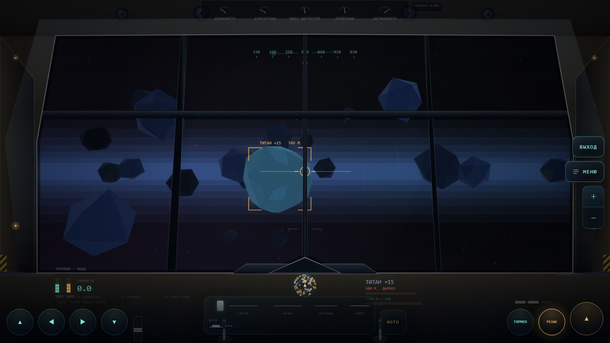

</div>

Play it at [drift-game.ru](https://drift-game.ru) — or download [`drift.html`](drift.html) and
open it. That is the whole game: one file, offline, no server. The interface is in Russian.

You fly a survey ship through a generated galaxy — prospect planets, dig mines, mine asteroid
belts, skim gas giants, trade, build bases, hire crew that keeps working while you are away,
board pirate stations on foot.

---

## Screenshots

Nothing below is hand-drawn. Hulls, cockpits, terrain, interiors and star fields are all built
from the seed of the system you are in. Shots are taken by `docs/mkshots.ps1` straight from the
build, one scene per run.

<table>
<tr>
<td width="50%" valign="top">
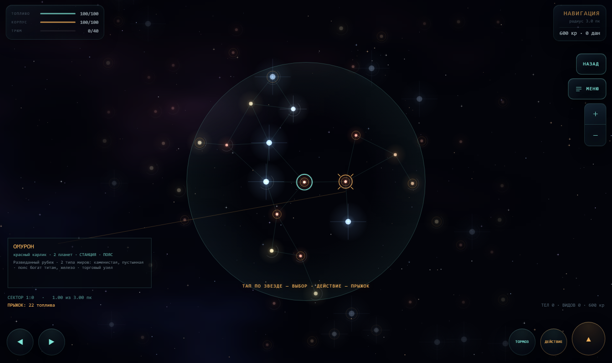
<b>Galaxy map.</b> Stars are light sources — halo, colour and diffraction spikes follow the
spectral class. Distance is rendered as darkness, the jump radius as a lit area; lanes are the
branching structure the galaxy was generated with.
</td>
<td width="50%" valign="top">
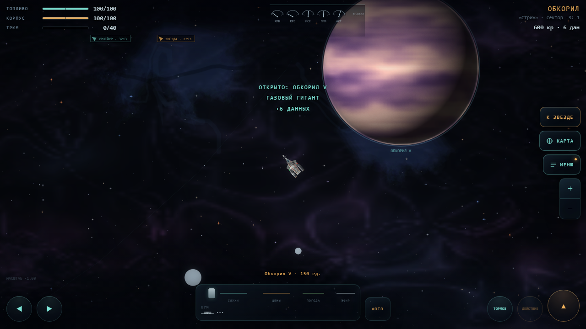
<b>System flight.</b> Orbits, a generated nebula and the five-needle instrument strip along the
top: every region of the galaxy bends exactly one of those needles, and the misclosure grows
toward the region's core.
</td>
</tr>
<tr>
<td width="50%" valign="top">
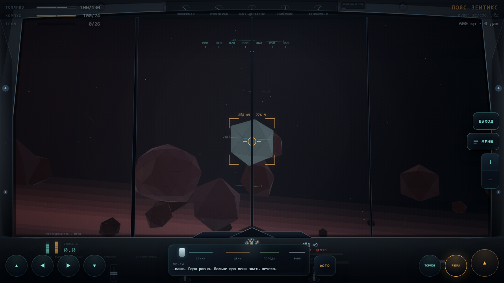
<b>Cockpits are generated per hull class.</b> A survey ship gets a thin frame and clean
plastics; the miner at the top of this page gets heavy pillars, rivets and hazard stripes. The
canopy opening has thickness — outer and inner contour with a lit bevel between.
</td>
<td width="50%" valign="top">
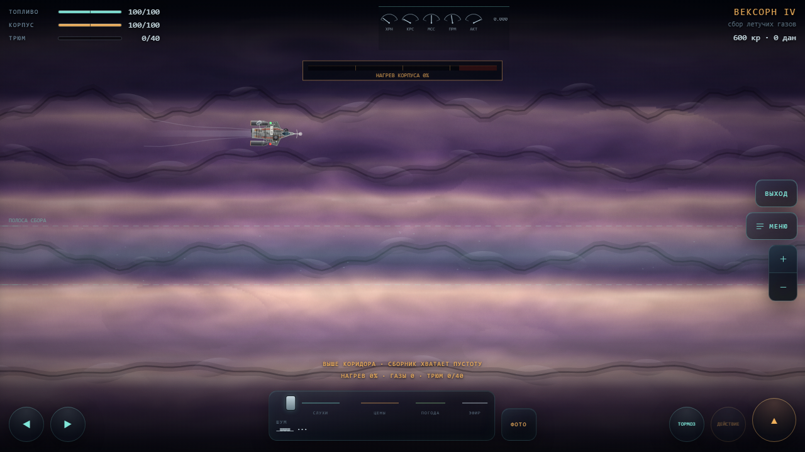
<b>Skimming a gas giant.</b> Bands are a noise field in perspective, fronts are sharp where
the contrast stretch crosses a palette stop. Hull heat climbs the deeper you dip.
</td>
</tr>
<tr>
<td width="50%" valign="top">
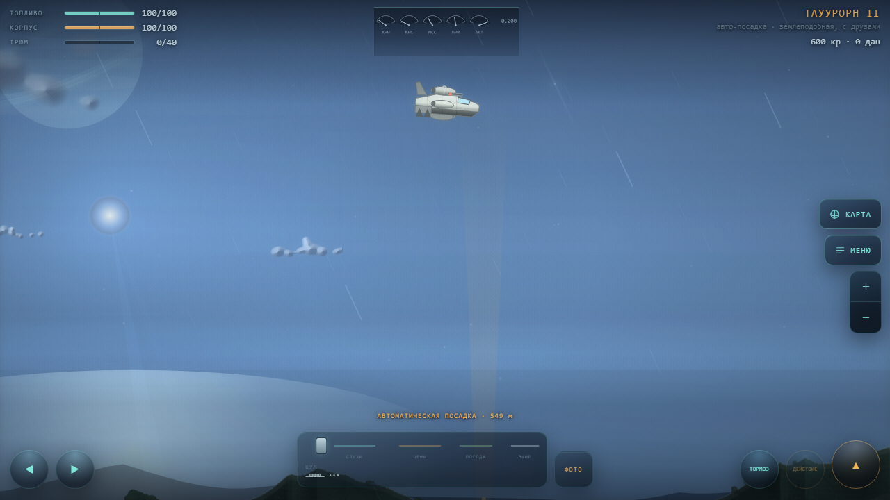
<b>Landing.</b> The lander silhouette is derived from the hull; weather is capped per world
type so a crystal planet is never washed flat white by fog.
</td>
<td width="50%" valign="top">
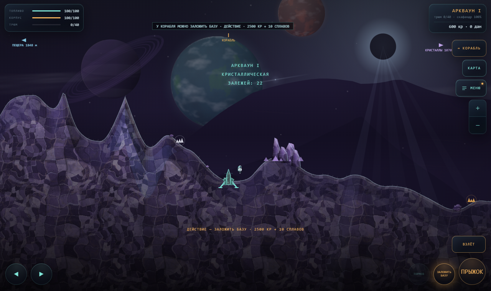
<b>On foot.</b> Flora and fauna come from the planet's genome; the ground is one baked
material tile holding three scales at once. The astronaut is the unit of scale — held at the
same share of the frame on any monitor, so you never have to look for yourself on a big screen.
</td>
</tr>
<tr>
<td width="50%" valign="top">
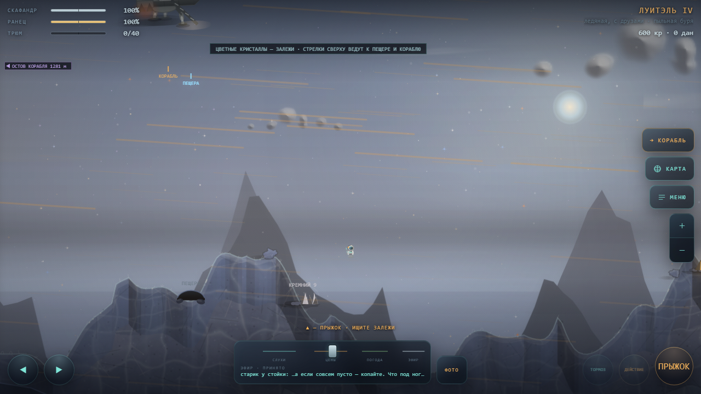
<b>Ice world.</b> Strata, relief amplitude and flora follow the world type; the sky keeps a
calendar — eclipses, parades and comets are computed from time, never rolled, so a meeting can be
set by them.
</td>
<td width="50%" valign="top">
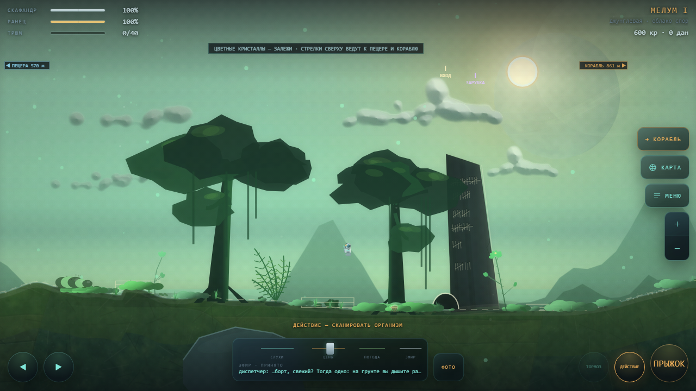
<b>Three lights.</b> A region with no night. Once in a few weeks its three suns converge, and
the third light shows a road, foundations and an entrance that ordinary light does not. The
shutters in every yard close the day before; nobody explains them.
</td>
</tr>
<tr>
<td width="50%" valign="top">
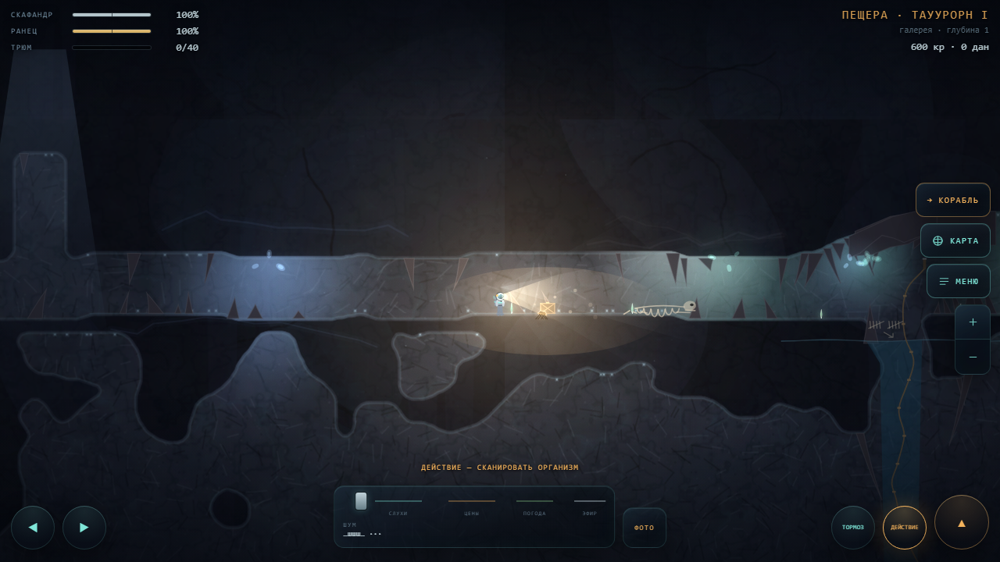
<b>Caves.</b> Two galleries, the lower one reached by shafts and left by jetpack; the suit lamp
is the only light unless the flora glows.
</td>
<td width="50%" valign="top">
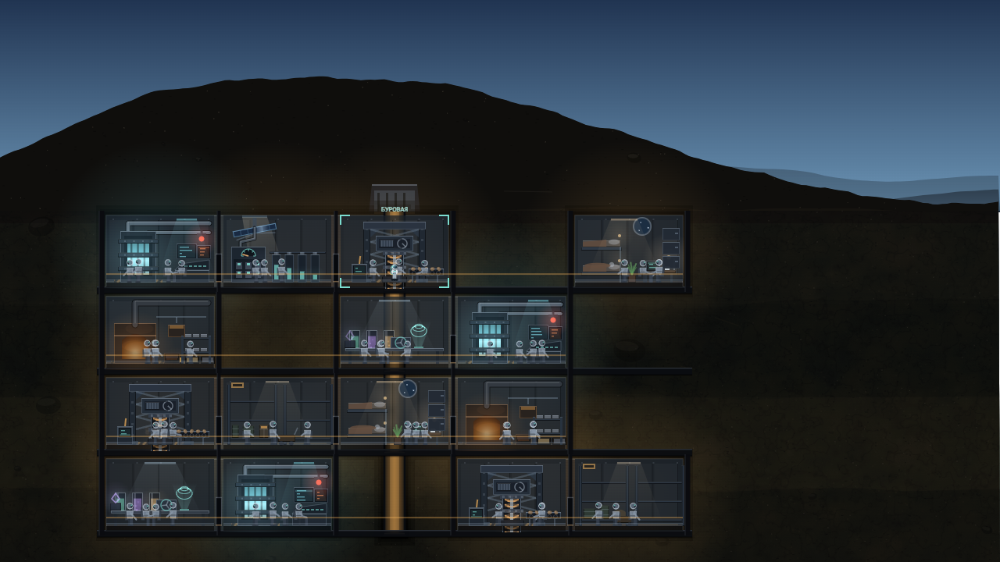
<b>Base cross-section.</b> Rooms are generated from a grid; each kind has its own interior with
its own work going on — the stoker drives his poker, the tallyman marks his slate, the lift cage
travels the shaft, the shift walks between rooms, and the smelter's smoke is taken by the wind
at the surface cap. Power runs in cable trays under the deck plating, a panel box per room.
</td>
</tr>
<tr>
<td width="50%" valign="top">
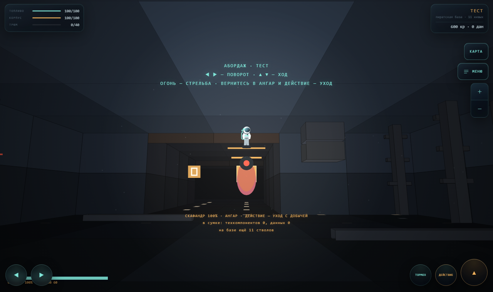
<b>Boarding a pirate base.</b> Corridors are projected from the belt's own polygons; the base
you fight through is the one you saw from outside.
</td>
<td width="50%" valign="top">
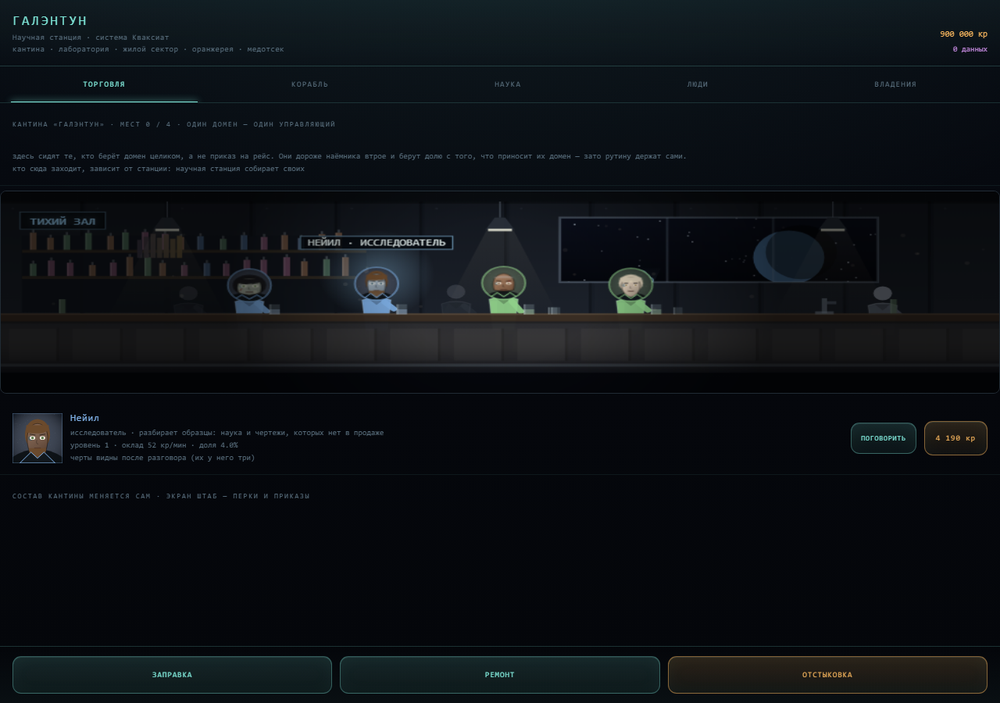
<b>Station cantina.</b> The hall, its bottles and its patrons are procedural; who sits there
depends on the station's kind. On this particular evening the travelling cinema has the wall —
a newsreel plays and the hall watches. Managers are hired here, one per domain.
</td>
</tr>
<tr>
<td width="50%" valign="top">
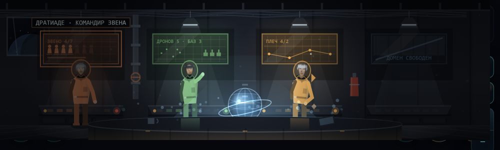
<b>The HQ bridge.</b> Each manager stands at his own board; portraits grow with level and
darken with loyalty. An empty seat is drawn as an empty seat.
</td>
<td width="50%" valign="top">
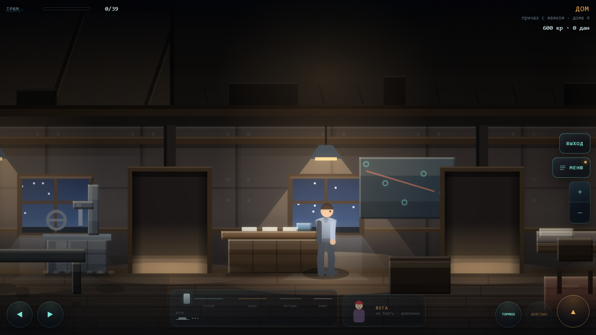
<b>The home from inside.</b> Eight tiers of turnover are eight rooms you walk through, each with
its own floor and its own things. The people who live there live there: Vega keeps to the study,
the lodger keeps house, off-duty crew rest in the hall.
</td>
</tr>
</table>

---

## Gameplay

### Worlds

Twelve world types — terran, ocean, desert, rocky, ice, volcanic, toxic, crystal, jungle, metal,
ruin, gas giant — and most planets are a blend of two. The blend covers palette, roughness,
gravity, sky, relief weights, strata, weather, clouds, musical mode and ore profile, and the
name comes out as "icy, with volcanoes". Air never blends: it is breathable or it is not.
Kinship is asymmetric — a volcanic ocean exists, an oceanic desert does not.

- **The ground is a material.** Each planet bakes one seamless tile holding three scales at
  once (geological patches, sedimentary runs and veins, grain and crystal specks), laid twice at
  different zooms so the repeat does not read.
- **Late worlds have a law of form** on top of the noise: faceted cells with one lit edge for
  crystal, plates with dark seams and rust for metal, a dappled canopy for jungle, axis-aligned
  rubble for ruin.
- **Weather cannot overrule the world.** Each type caps its own weather strength, so a crystal
  planet is never washed flat white by fog.
- **Three scales of object.** Boulders underfoot, a middle scale belonging to the type (druses,
  hull plates, broken trusses, walls, columns, canopy trees), and two to four landmarks per nine
  thousand units of terrain — a wreck, a temple, a space elevator, an accelerator ring, an
  anomaly. The empty space between them is deliberate.

### Flying

- **Autopilot** — tap an object to approach, close in and dock. It aims at an intercept point,
  so it converges instead of chasing an orbiting body. Near a planet or moon it captures a
  stable co-rotating circular orbit and holds it until you throttle, brake or turn.
- **Manual control** — thrust, a brake that kills velocity outright, and turning with angular
  inertia, so the ship carves an arc and banks into it. Every key is rebindable (separate
  layouts for flight and belt); on-screen buttons auto-hide when a keyboard is in use.
- **Branching star map** — systems with connecting lanes and generated flavour text. Planets
  follow elliptical Keplerian orbits; orbital speed is capped by tangential velocity, so every
  body is catchable in the starter ship while distant worlds still move more slowly.
- **Gravitic anchor** — drift too far from the star and a gentle pull plus an on-screen compass
  bring you back. A one-tap "TO STAR" autopilot works from anywhere.
- **Stranded restart** — out of fuel with no way to refuel, you can pay for evacuation. Without
  the credits you wake up at home, take a ship from the garage and lose the cargo and half your
  credits. Before there is a home, you get a fresh starter ship at the origin system. There is
  no dead save.

### Getting materials

- **Surface prospecting** — land on generated terrain (ridges, mesas, dunes, cratered plains,
  canyons, mixed per world type), mine visible deposits, scan flora and fauna for research data.
  Click-to-walk works alongside the keyboard; launch is a hold-to-confirm button.
- **Wildlife** — each planet has a genome biasing plant and animal forms, sizes and hues.
  Underground the same stock bites through your suit; an EMP pulse stuns them, and a stunned one
  can be sampled for carbon and rare xenobiome no rock yields.
- **Deep shafts** — sink a mine on bare ground and tunnel through three depth tiers. Ore sits in
  scattered veins, highlighted through rock when close or at range with the geo-scanner. Deeper
  rock is roughly 2× and 4× richer, gated behind drilling tech and pressured by suit wear and
  cave-ins. Damage underground costs the suit, never the ship.
- **A shaft stays dug.** Return to a mine and you drop into your own tunnel: only excavated
  cells are saved, everything else is re-derived from the seed.
- **Cave systems** — some planets hide a walkable cave mouth: a winding passage lit by your suit
  lamp and glowing flora, with hostile fauna and a one-off data find at the end.
- **Asteroid belts** — a 3D flight mode flown from a generated cockpit. Pitch, yaw and roll with
  inertia, the horizon banking into turns. Rocks break into drifting debris as you mine or shoot
  them.
- **Gas skimming** — enter a gas giant's upper atmosphere to collect volatiles. The scene is a
  narrow altitude corridor: above it the scoop takes nothing, below it hull heat climbs until
  the ship burns, and turbulence keeps pushing you out.

### Rare materials

Ordinary ore is cargo looking for a buyer. The four rare materials are the opposite — the market
refuses them entirely, so they stay goals rather than expensive cargo and cannot inflate prices.
Each has its own source:

| Material | Source |
|---|---|
| Volatiles | atmospheric skimming on gas giants |
| Ice crystals | belts on distant, cold orbits only |
| Alloys | never mined — smelted from ore at industrial stations or a base refinery |
| Tech components | boarding a pirate base, and nowhere else |

They are spent on the laboratory, base construction and hull fusion. Drones only work materials
they can sell, and pirate wrecks never drop rare stock.

### Stations

Seven station types, chosen by system seed and sector danger. The type decides which tabs exist:

| Type | What it is for |
|---|---|
| Trade hub | best prices, broad market, weak yard — thins out toward the frontier |
| Industrial | smelts ore into alloys, repairs at half price |
| Shipyard | the only place that builds a one-off unique hull |
| Science | tech tree and the fusion laboratory |
| Frontier outpost | combat crews, weapons, poor prices — common in dangerous space |
| Fuel depot | no tabs at all: fuel and repair only, but found far out |
| Bazaar | the flea market: used goods with a provenance, quoted in house scrip |

Each type draws itself procedurally like hulls do — a shared skeleton of core, dock and lights,
silhouette from the type, details from the system seed: warehouse pods and cargo booms, blast
furnaces with a flare stack, an open slipway with a crawling crane, dish antennas and radiator
grids, gun turrets, or a bare tank.

### Crew and fleet

Old hulls in your hangar stop being dead weight: **a hire needs one of your ships**, which is
the constraint the whole system turns on.

- **Mercenaries are generated people** — name, specialty (combat, mining, hauling), two or three
  traits that act as multipliers and thresholds. A veteran costs more and comes back. The
  careful one breaks off early and brings less. The greedy one skims the hold. The stubborn one
  ignores your first order.
- **Orders** — hunt pirates, mine, run a route, work a base, or idle. Each carries a sector and
  resolves the way drones do: from elapsed time, capped at eight hours offline. Nothing flies
  around in the background.
- **Wages and consequences** — pay is drawn on the same lazy clock that pays out. Run dry and
  debt accrues, morale slips, the log warns you, they work at half strength, then abandon the
  order, then leave and take the ship against what they are owed. Every step is visible before
  the last one lands.
- **Damage and repair** — dangerous orders cost hull. Repair is free and slow while idle,
  instant for credits. A hull reaching zero loses the ship and only sometimes returns the person.
- **Experience** raises both output and demands, so a cheap hire becomes an expensive veteran.
  Fleet size is a researched licence.
- **Meeting them in space** — fly into a sector where your crew is working and they spawn as a
  real ship alongside you, built on the pirate NPC frame, shooting at pirates.
- Everything they do lands in the ship's log.

### Managers and domains

Mercenaries fly your ships; managers take a whole domain — the crew wing, drones and bases, a
trade route, or the laboratory. There are exactly four seats, one per domain, and the AI core
takes one of the four rather than adding a fifth. The system is about which chore you hand over,
not about headcount.

- **A cut of the domain.** Each manager draws a salary and a percentage of their own domain,
  taken before the money reaches you and always shown as a line. Audit tech and one artifact are
  the only things that reduce the cut.
- **Loyalty is the tension.** Miss payroll and it slides; below fifty a manager starts quietly
  losing a slice of the domain in their own favour, traceable only as a discrepancy line in the
  domain summary. At twenty-five they issue an ultimatum you can pay or refuse.
- **A manager who leaves flies against you.** At zero loyalty they defect and become a renegade
  in their own sector, flying your flagship with your perks. Beating them does not kill them:
  they reappear in a cantina as an exile, cheaper to re-hire and remembering everything.
- **Every perk is wired to something.** The whole tree is visible from the start, and a test
  fails if any perk id in the tree is not read by the game.
- **Procedural portraits** gain detail with level and darken as loyalty drops.
- **Artifacts** — seven from the laboratory, one worn per manager, each with a second effect
  line that unlocks deeper in.

### Home

There is exactly one home and it is not for sale. Rooms bought with credits would make it
another shop; instead the home grows out of accumulated turnover — everything the universe has
paid you, from sales and drones to domain income, mercenary runs, bounties and base takings.
Nothing is ever deducted: money already spent still counts toward it.

- **It appears on its own** after your first honest sale, in whatever sector you were in, and
  never moves. Eight tiers follow: rented corner, hall, garage, showcase, workshop, study,
  living quarters, berth with a beacon.
- **Death is not a wipe.** Losing your ship with no evacuation money puts you at home with a
  ship from the garage, minus the cargo and half your credits.
- **The tiers do things.** The study gives every manager one more standing-order slot; living
  quarters double morale recovery; the showcase turns displayed rare material into reputation
  worth up to a tenth extra from your domains; the workshop rerolls a part's affixes one tier
  down — not an upgrade but a second throw, so junk becomes usable and good parts are not worth
  touching.
- **It cannot be farmed.** No free fuel, repairs or weapons; the beacon home is paid for and
  costs more the further out you are; anything on the showcase can never be sold.

### Bases

The planet stays 2D; the volume comes from a cut through the ground — sky and surface on top,
buried compartments below, a lift shaft down the middle.

- **The grid is the game.** An empty cell is rock you dig out to place one module: reactor,
  solar array, drill, storage, habitat, refinery, landing pad.
- **Power is the constraint.** Run short and the lights dim across the whole cut and the drill
  stops.
- **Adjacency matters.** A drill wired to a neighbouring reactor loses less; a habitat pressed
  against one is a worse place to live.
- **Staff** — crew can be posted to a base in four roles: driller, engineer, guard, logist. Any
  role is open to anyone, but working outside your speciality halves your contribution.
- **Raids** — pirates come for the store, more often the deeper into dangerous space the base
  sits. An unguarded raid carries off part of the store and sometimes wrecks a compartment,
  which stays dark and crossed out until an engineer rebuilds it.
- **The network** — a station panel shows every base, what it digs, how full it is and what is
  wrong. A landing pad lets you jump straight there; a posted logist lets you collect the store
  without flying out.

### Boarding pirate bases

Dangerous sectors hold pirate stations you can board on foot. The map is a 2D grid — rooms
carved out, corridors drawn between them so connectivity holds by construction — drawn as
polygons through the same projection and painter sort the asteroid belt uses.

- **The gun fitted to your ship is the gun you carry**, so the build you fly decides how the
  boarding goes. The suit is your health, the same one the mine models.
- **Four enemy types** share one AI and differ in numbers: rushers close to arm's length,
  heavies hold back and hit hard, and the bridge keeps a boss. The compartment decides who is
  waiting.
- **Supplies are finite** — ammunition runs out, so the store room matters; medkits and armour
  plating lie where they make sense and are picked up by walking through them.
- **Rooms have mezzanines** with ramps up: floors at two heights, real edges on the drop, camera
  following you up. Corridors get door jambs, reactor bays pulse with emergency lighting, and a
  helmet lamp lights whatever you face.
- **Loot is the stake** — reach the hangar to leave with it, or get your suit punctured and lose
  half on the way out. Progress itself is never rolled back.

### Getting stronger

- **A hundred hulls in six tiers** — eight hand-built ships plus a deterministic catalogue of
  ninety-two, from workhorses to legends counted in single units and yachts that never pay for
  themselves. A dock stocks a slice keyed to its seed and a time bucket, not the whole list.
  Rarity shows in the finish, and a cheap hull is always available so you cannot be stranded.
- **A thousand nodes and ten crowns** — named artifact nodes in ten families of a hundred, five
  rarity grades. A node does nothing alone; completing a family forges a crown, an effect
  unobtainable any other way, read by `stat()` alongside modules and parts. Nodes are never sold
  or crafted: they only drop, rarely, from pirates, deep shafts and boarding actions.
- **Modules** — seven upgrade tracks (engine, tanks, hold, armour, drill, hyperdrive, gun), four
  levels each. Buying a level is permanent; fitting it is not.
- **Parts and rigging capacity** — every hull has a rigging budget that modules and parts both
  draw from, so you cannot run everything at once. Parts come in six categories with one to
  three affixes, and the strong ones carry a real drawback — a drill that outpaces your turn
  rate, a shield that costs thrust. They drop from pirates as containers you fly through, and
  stations sell a rotating handful.
- **Ship screen** — slots are drawn on the hull itself: a gun point on the wingtip, an engine
  block at the nacelle, a reactor in the belly. Every candidate part states what it would do to
  your numbers before you commit.
- **Laboratory** — at science stations, two ships from your hangar plus rare material fuse into
  a third. Stats blend weighted toward the stronger parent instead of summing, surplus rare
  stock adds a percentage, and both originals are consumed. Each generation costs 1.8× more and
  adds a fraction as much, so the ladder has a top. The same bench crafts parts from rare
  material at three tiers.
- **Tech tree** — research paid for with survey data, including repeatable tracks that keep
  scaling.
- **Return beacon** — researched tech that teleports you back to your lander from anywhere on
  the planet, on a cooldown.

### Economy and logistics

- **Living market** — every station's prices sag when you dump cargo there and recover over
  time, so where you sell matters and routes are worth planning. Station type shifts prices on
  top of that.
- **Mining drones** — buy one, drop it on a deposit or asteroid, fly away. It works in real
  time, hauls to the nearest station and sells at live prices.
- **Barter shop** — a tab where unique gear costs specific raw resources instead of credits.
- **Ship's log** — a collapsible panel recording kills, drone deliveries, sales, research,
  discoveries, crew reports, base raids and wrecks. It persists with the save.

### Landing

Setting down is its own short flight. You fly the lander against the world's real gravity, and
touching down too fast, too sideways, tilted or on a slope costs hull.

- **The lander has a side-on silhouette of its own** — 90 to 130 px against a 24 px astronaut,
  because the flight view is top-down and rotating one into the other does not work. Hull
  colour, livery and class markings still come from the ship you fly.
- **Landing gear behaves.** Legs unfold on approach, each pad settles onto its own patch of
  terrain, struts compress on impact and spring back, and the nose dips with them.
- **Thrust is vertical**, so three retro nozzles fire from the belly, never the main engines,
  and the jet raises a low cloud of ground-coloured dust that lingers after touchdown. On an
  airless world the dust is lower and sharper.

### The front: pirates take systems

- **Occupation spreads from a source** — a nest, then its neighbours, never a random flare on
  the far side of the galaxy, so the map shows a front rather than a rash.
- **Occupation takes services away.** Level one puts patrols out and lets the single remaining
  buyer underpay you. A blockade shuts the dock and the laboratory and stops drones selling.
  Under full occupation only refuelling is left.
- **Ranks** — jackal, veteran, captain, and, only under full occupation, a baron: three times a
  mini-boss's toughness, sitting on the bridge of the baron's lair, which is the same boarding
  action made harder.
- **You take a system back by playing in it.** Kills count per system; hit the quota and the
  level drops. Clearing it pays a prize and turns the station back on. Breaking the pirate base
  suppresses the nest and stalls the advance around it for a day.
- **Three goals are stated on the holdings screen** — the home that grows from turnover, a yacht
  of your own, and a galaxy without occupied systems. All three are counted from real state,
  with no quest flags.

### Work that pays

The cantina seats people with their own business, and none of it is "bring me ten ore". You
answer: buy a captain's debt at a third of face value, vouch for a pilot nobody will hire, take
a crate with no explanation, back a bet on someone else's race, buy a survey map off a geologist
thrown out of his expedition, carry a passenger with no return ticket. Every answer costs
something, and answers with a tail become journal entries with an address and a deadline. The
outcome roll is made in advance from the deal's key, so a deal cannot end differently depending
on when you open the journal.

The journal holds accepted business: what you took, from whom, how long is left, what was
promised. Every line with an address is clickable and lays the course on the map.

### Pirates

A pirate welds his ship out of three other people's, and that is his language of form.

- Sixty to a hundred and twenty polygons: a dark body mass, a spine of overlapping plates, a
  nose or a ram, side modules, cargo cages, engines. Asymmetry is a rule — a pylon on one flank,
  a fuel tank on the other, a foreign section welded on, scrap collecting on the busy side.
- Hung over that: patches lapped over seams, spikes, tow hooks, turrets on guy wires, whip
  antennas, rust from every weld, kill marks by seed.
- **Damage is visible and cumulative** — scorches, then a breach with flame, then a smoke trail.
  Below half hull the ship is rebaked with its hung gear torn off and bites out of the plating,
  so a wreck reads by silhouette instead of a health bar.
- Exhaust is dirty and out of sync, and one engine on every pirate smokes harder than the rest.

### Danger is optional

Pirates are absent near home and increasingly common the further out you push. Fighting has its
own gun module and bounty tech, but outrunning or jumping away is always cheap and always valid.
Bases, boarding and mercenary hunts are opt-in layers on top.

### Home

The home is not a screen of cards: it is a house standing on its own planet. Land there and the
navigator shows **ДОМ**; walk up and the porch lamp is on, the chimney smokes, the window is lit,
and every tier you have earned is out in the yard — garage, display case, workbench, the mast with
its beacon. Go in and you walk its rooms: eight tiers, eight rooms, each with its own floor and
its own things to stand next to and look at, openings that show the next room's lamplight, and
blank masonry where the house has not grown yet. The people who live there live there — Vega sits
in the study, gets up, walks, works and answers when hailed; the lodger keeps house, the trainee
fiddles in the workshop, off-duty crew rest in the hall.

### The road companion

On a phone, «В ДОРОГУ» turns a real trip into flight: GPS speed ×1 000 000 becomes cosmic
(a highway reads as hundreds of km/s, a plane as a fraction of lightspeed), the accelerometer
banks and sways the hull through real turns, acceleration pulls it up the screen and braking
down, and the microphone drives the scene — nebulae change colour with the music's mood, a
beat births falling stars, the bottom of the screen glows with the track. Real land is mapped
onto the universe: every ~2.8 km cell is a named star system, and other pilots riding the same
sector fly alongside as distant companion lights — a spark with an exhaust each, the same set for
everyone in the cell (an anonymous tag and a cell number are all that leave the phone).
Kilometres earn capped in-game credits, with a combo for riding without stopping.

## Graphics and sound

- Every hull is generated from its seed: multi-station fuselage profile, swept wings, nacelles,
  canopy, panel lines, greebles, livery, blinking navigation lights. Banking is a real roll —
  the silhouette squashes and a shaded belly shows.
- The belt cockpit is generated per hull class: canopy shape, frame weight, metal, wear, hazard
  striping, holography and indicator colour follow what you fly, and a lab-fused hull gets an
  asymmetric frame nothing else has. Everything laid on the glass is transparent, and the six
  instruments on the dash are the ones nothing else already tells you.
- Plants, creatures and boulders are generated per world: branching stems with ferns, pods or
  crowns; critters with their own colours, crests, tails and leg counts; layered strata showing
  through rock.
- Layered engine flames and an exhaust ribbon that hangs where you burned. Attitude jets fire
  against the turn the way a real pair does, and braking uses the bow jets instead of spinning
  the ship. Faceted rotating asteroids lit by the system's star, ringed gas giants, a generated
  nebula, coloured twinkling starfields.
- A graphics page trades looks for performance: draw distance, model detail, particle density
  and surface life density, with presets.
- **Every sound is synthesised at runtime** — there is no audio file in the project. Oscillators,
  filtered noise and envelopes make the engine hum that rises with throttle, weapon fire, hull
  hits, the drill, footsteps that follow the walk cycle, low-fuel warnings. Guns take their
  timbre from the fitted part's seed; each creature's call comes from its own seed. Music,
  effects and engine have separate volume sliders.
- **Generative music** — no tracks, six layers (drone, bass, motif, beacons, percussion,
  atmosphere) drifting in and out, so there is no loop to notice. Notes swell over a second or
  more into synthesised reverb and feedback delay. The beacon voice is brown noise through a
  narrow band-pass filter. The melody walks the scale and is sometimes answered a beat later by
  a third or a fifth. Sixteen modes are in play; each location has its own mode and tempo, and
  planets pick theirs from the genome that decides their plants, so a world sounds the same each
  time you return. A single tension value (pirates closing, a battered hull, mine depth) tightens
  the rhythmic grid and thickens percussion instead of switching to a combat track.

## Persistence

Local autosave, portable base64 save codes for moving between devices, and optional cloud sync
against your own server. The save format writes `v5` and still reads `v4`: every new feature is
added with a safe default, so a save written before crews, bases, alloys or fusion existed still
loads — it simply has none of them. Anything derivable from a seed (systems, orbits, belts, station
types, pirate bases, base geology) is regenerated on load; only your decisions and what you
carried home persist.

## Project structure

| File | Purpose |
|---|---|
| [`drift.html`](drift.html) | The entire game in one self-contained file — open it directly to play. **Built from `src/`; do not edit by hand.** |
| [`src/`](src) | Sources: `index.html` shell, `style.css`, and ~220 JavaScript modules (core maths and RNG, galaxy, planets, ships, parts, audio, music, economy, crew, save, one per game mode, UI). Concatenated in filename order, since it all shares one scope. |
| [`tests/`](tests) | A hundred-odd test suites by topic (`90-harness`, then `91a-flight` onward). They drive the real game state through `resetWorld()` and mock nothing. |
| [`build.ps1`](build.ps1) | Rebuilds `drift.html` from `src/`. No dependencies — PowerShell, because Node is not assumed. `-Watch` rebuilds on save. |
| [`site/`](site) | The [drift-game.ru](https://drift-game.ru) pages: front page, accounts and cloud saves (one small PHP endpoint, `api.php`), and the standalone 3D bird. Published automatically on push. |
| [`bird/`](bird) | Sources of the 3D bird (WebGL2, `bird.ps1` builds them into one self-contained file). Not part of the game. |
| [`CLAUDE.md`](CLAUDE.md) | House rules for working on the code: what lives where, what must not change, how to verify. |
| [`PLAN.md`](PLAN.md) | The live plan: cross-cutting rules and the milestones still ahead. |
| [`docs/PLAN-archive.md`](docs/PLAN-archive.md) | Design log — every finished milestone, what it solved and why it was built that way. |
| [`docs/INDEX.md`](docs/INDEX.md) | Generated address book of the sources: every top-level symbol as `file:line`. Grep it, do not read it. |
| [`PATCHNOTES.md`](PATCHNOTES.md) | One entry per version: what changed and what it fixed. |

## Running it

**To play:** open `drift.html` in any modern browser. No server, no build, no dependencies.

**To work on it:** edit files under `src/`, then rebuild:

```bash
powershell -ExecutionPolicy Bypass -File build.ps1
```

The same build produces `tests.html` — open it in a browser and it runs the suites against the
real game state (currently ~11 800 assertions across 379 suites, nothing mocked) and prints the
report on the page; `test.ps1` runs the same thing headless.

Module order matters: the whole game shares one scope, so constants and tables must be declared
before anything reads them at top level. A new module gets a new numeric prefix in the right
place; fractional steps (`19a-`) avoid renaming neighbours.

**To self-host with cloud saves:** put [`site/api.php`](site/api.php) on any PHP host and point
the cloud config inside the game at it — accounts and cross-device saves need nothing more than
that one file and a writable folder. Without it the game still saves locally and exports
portable save codes.

## Status

Version 0.224.0. Everything described above is built and playable, online at
[drift-game.ru](https://drift-game.ru) with accounts and cloud saves, or offline from this file.

Four development passes are behind it. The first finished the planned queue: celestial
mechanics, station types, rare materials, mercenaries, bases, the laboratory, boarding, twelve
blended worlds, the side-on lander, welded pirate hulls, the home that grows on its own. The
second gave those abstractions a body — barges flying the factor's real routes, a barge in
distress you can rescue or finish off, a hundred rarities at fixed addresses instead of on a
drop chance. The third scattered one story across a hundred fragments found by the piece: survey
marks, a sky calendar, a settlement that decides for itself what to build, a repeater bird that
improves while it sits in your hold, a meadow that replays, during an eclipse and only
then, the people who once crossed it, a plant on a dead world still working its shift for an
owner who never came back, and a four-armed digger paid in food who repeats at the tables
everything he has seen. The fourth gave the galaxy its regions — thirteen edges, each with its
own law, its rumours and its returners — and the game its release face: a bottom console with a
tunable receiver on every screen, one table that holds everything you read, and the road
companion that flies your ship along your real commute.

The fourteenth pass is finished too — the kit and the suit doll, the lodger who moves in, the
record book, the institute and its expedition, the trainee, and the phone edition. After it the
game was looked at again screen by screen (the settlement, the mine, the cantina, deposits, the
ground cross-section, the gas giant), and the home stopped being a panel and became a house you
walk into.

Since then the game grew its through-line — an arc about access instead of credits, offers with
faces and windows that close quietly, and an ending that is never explained — and went through
a full cosmetic audit under eight laws (every light has a source, everything standing casts a
shadow, work is visible, motion never blinks). Noon finally looks like noon: the sky, the
shadows and the light all know the hour. The frame holds 60 fps in all nine modes.

Nothing is queued. The game lives as a sandbox; new work starts from the author's eye.
Balance is tuned against measurements, so the numbers move between versions.
